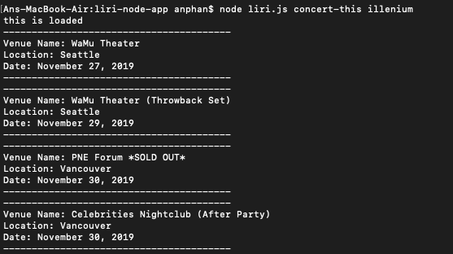
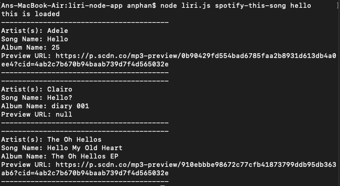
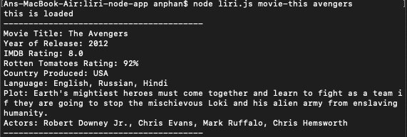
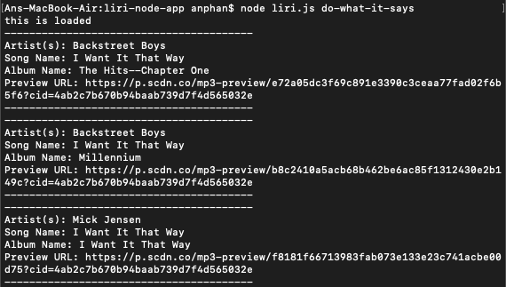

# liri-node-app

# Introduction
Node.js homework assignment using LIRI bot to call Spotify, Bands in Town for concerts and OMBD for movies. This app is useful when searching for certain artists, songs, or movies. The app will retrieve data pulled from each API and send the information back to the terminal and provide results on what was searched.

# Commands
Using the Liri commands, you can do four commands:

1. node liri.js concert-this ```<insert artist name here>```

This will search for the artist, the city, and the venue of where they are performing.



2. node liri.js spotify-this-song ```<insert song name here>```

This will search for the song name, artist, album, and preview URL.



3. node liri.js movie-this ```<insert movie name here>```

This will search for the movie tite, year of release, IMDB rating, Rotten Tomatoes rating, country the movie was produced in, languages, and the plot.



4. node liri.js do-what-it-says

This will pull up the random.txt command, which is to search for I Want it That Way by the Backstreet Boys.



# Sources/Technologies Used
* API's
  * Bands in Town
  * OMDB
  * Spotify
* Javascript, Node.js, Node packages
